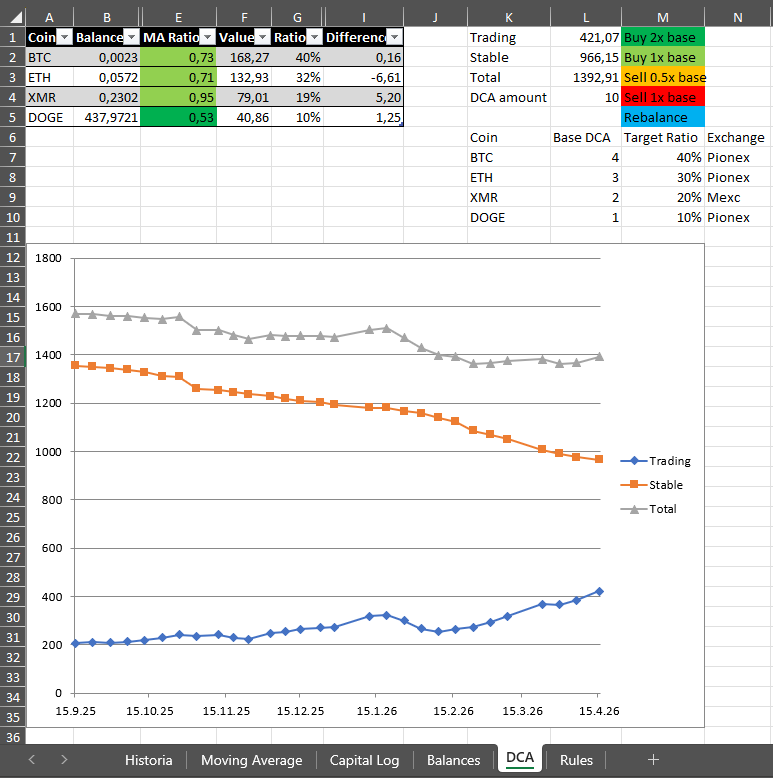
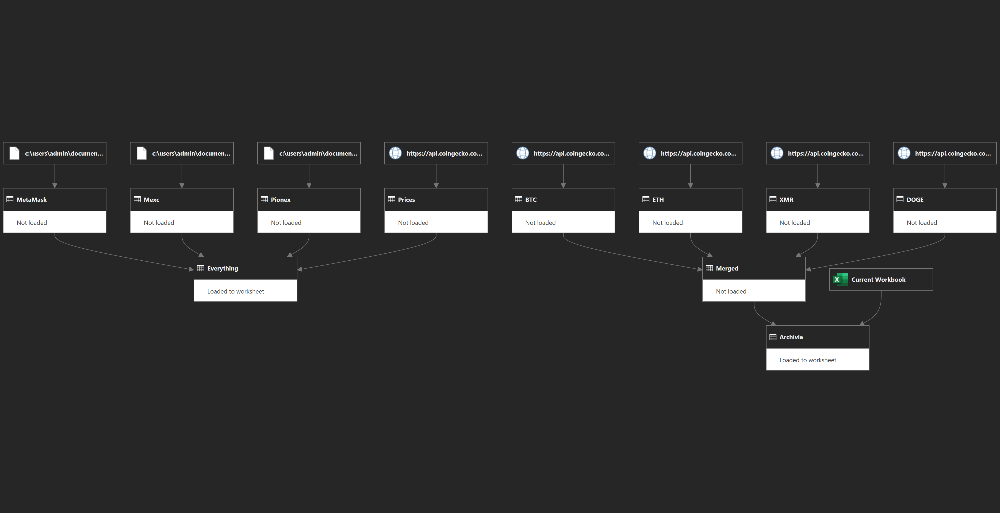

**[Читать на русском](README_RU.md)**

# SDET Portfolio: Automation, API Integration & SQL Analytics

This repository showcases my transition into Software Development Engineer in Test (SDET) roles, focusing on infrastructure automation, secure API handling, and data-driven testing strategies.

## 🚧 Project Status & Roadmap

**Status:** Work in Progress (WIP)
This repository is actively updated as I expand my automated testing portfolio. 
* **Upcoming Feature:** Integration of **Playwright** for end-to-end (E2E) web testing.
* **Upcoming Feature:** Automated CI/CD pipelines using GitHub Actions for the Python test suite.

## 📁 Project Structure

* **`python/`**: API clients for MEXC and Pionex, logic testing, and OOP-based user management.
* **`automation-scripts/`**: PowerShell scripts for automated system maintenance and client-side operations.
* **`sql-analytics/`**: Complex SQL queries utilizing CTEs and Window Functions for data validation.
* **`images/`**: Architectural visualizations.

---

## 🚀 Key Projects

### 1. Automated API Clients (Python)
Developed modular clients to interface with cryptocurrency exchanges (MEXC, Pionex).

* **Security:** Integrated `python-dotenv` for secure credential management, ensuring zero exposure of API keys.
* **Data Normalization:** Designed logic to save JSON responses locally for downstream analysis.

### 2. Design Patterns & Logic Testing
Demonstrated the use of creational and behavioral patterns to build scalable test architectures.

* **User Management (Factory Pattern):** Utilized `UserFactory.py` to handle the creation of user objects and their associated permission levels, ensuring a clean separation between data setup and test execution.
* **Test Orchestration & Validation:** Developed `TestManager.py` to process test results, filter "Passed" states from JSON data, and manage the output of the testing suite. 
* **OOP Principles:** Focused on encapsulation and inheritance to ensure that the testing logic remains maintainable as the project grows.

### 3. Infrastructure Automation (PowerShell)
Automated routine maintenance tasks for banking client environments.

* **Efficiency:** Achieved significant time reduction by automating manual file checks and silent installations.
* **Reliability:** Integrated error-handling logs to monitor script execution.

---

## 📊 Data Integration & Visualization

* **Semi-Automated Tracking:** Designed to automatically refresh and track delta changes every time the Python API clients update the local JSON repositories.

* **Verification Engine:** Serves as a "Source of Truth" to verify that raw data remains consistent across updates, allowing for immediate visual regression testing of the portfolio state.

* **ETL Robustness:** (As shown in Figure 2) The pipeline includes built-in error handling that identifies missing or disconnected data sources, ensuring the dashboard only reflects verified, loaded information.

*Figure 1: Performance tracking dashboard showing capital allocation fetched from the aformentioned JSON files.*

*Figure 2: Power Query architecture demonstrating the merger of multiple API streams (MEXC, Pionex, CoinGecko) into a unified data model.*
