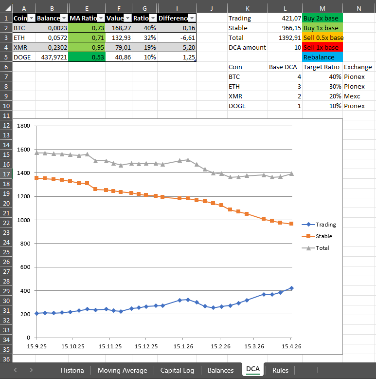
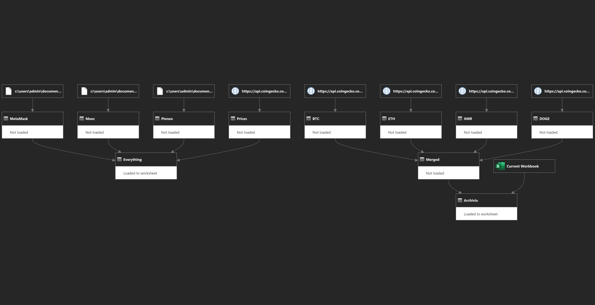

# SDET Портфолио: Автоматизация, Интеграция API и SQL Аналитика

В этом репозитории представлены мои наработки при переходе на роль SDET (инженер по автоматизации тестирования). Основное внимание уделено автоматизации инфраструктуры, безопасной работе с API и стратегиям тестирования на основе данных.

## 🚧 Статус проекта и планы

**Статус:** В разработке (WIP)
Репозиторий активно обновляется по мере расширения моего портфолио автоматизации.
* **Скоро:** Перевод скриптов **Playwright** в масштабируемую архитектуру **Page Object Model (POM)**, с использованием многократно используемых **Pytest фикстур** и добавлением **API-тестирования**. Интеграция сквозного (E2E) веб-тестирования.
* **Скоро:** Автоматизированные CI/CD пайплайны через GitHub Actions для тестового набора на Python.

## 📁 Структура проекта

* **`python/`:** API-клиенты для MEXC и Pionex, логическое тестирование и управление пользователями на базе ООП.
* **`python/playwright_practice/`**: Скрипты автоматизации пользовательского интерфейса, демонстрирующие обработку iframe, динамическую прокрутку и многое другое.
* **`automation-scripts/`:** Скрипты PowerShell для автоматизированного обслуживания систем и клиентских операций.
* **`sql-analytics/`:** Сложные SQL-запросы с использованием CTE и оконных функций для валидации данных.
* **`images/`**: Визуализация архитектуры.

---

## 🚀 Ключевые проекты

### 1. Автоматизированные API-клиенты (Python)
Разработка модульных клиентов для взаимодействия с криптовалютными биржами (MEXC, Pionex).

* **Безопасность:** Интеграция `python-dotenv` для безопасного управления учетными данными, что исключает утечку API-ключей.
* **Нормализация данных:** Реализована логика сохранения JSON-ответов локально для последующего анализа.

### 2. Паттерны проектирования и логическое тестирование
Демонстрация использования порождающих и поведенческих паттернов для создания масштабируемой архитектуры тестов.

* **Управление пользователями (Factory Pattern):** Использование `UserFactory.py` для создания объектов пользователей и соответствующих уровней доступа, что обеспечивает четкое разделение между подготовкой данных и выполнением тестов.
* **Оркестрация и валидация тестов:** Разработка `TestManager.py` для обработки результатов тестов, фильтрации успешных состояний («Passed») из JSON-данных и управления выводом тестового набора.
* **Принципы ООП:** Упор на инкапсуляцию и наследование для обеспечения поддерживаемости логики тестирования по мере роста проекта.

### 3. Автоматизация веб-интерфейса (Playwright и Python)
Практика основных механизмов автоматизации интерфейса в сложных динамических веб-приложениях (Heroku-app, динамические таблицы).

* **Синхронизация и стабильность:** Освоены условные циклы для механики бесконечной прокрутки и встроенное автоматическое ожидание для обработки нестабильных, асинхронных загрузок страниц.
* **Сложные компоненты пользовательского интерфейса:** Автоматизированное взаимодействие с изолированными элементами `iframe` и синхронизированная проверка состояния для постраничных таблиц данных (обработка элементов на странице, поиск и отслеживание записей).
* **План развития архитектуры:** В настоящее время осуществляется перевод разовых функциональных тестов в структурированную архитектуру Page Object Model (POM) с многократно используемыми фикстурами Pytest.

### 4. Автоматизация инфраструктуры (PowerShell)
Автоматизация рутинных задач по обслуживанию сред банковских клиентов.

* **Эффективность:** Значительное сокращение времени за счет автоматизации проверок файлов и «тихой» установки ПО.
* **Надежность:** Интеграция логов обработки ошибок для мониторинга выполнения скриптов.

---

## 📊 Интеграция и визуализация данных

* **Полуавтоматическое отслеживание:** Система спроектирована для автоматического обновления и отслеживания дельта-изменений при каждом обновлении локальных JSON-репозиториев через Python API-клиенты.

* **Verification Engine:** Служит «Источником истины» (Source of Truth) для проверки консистентности данных, позволяя проводить немедленное визуальное регрессионное тестирование состояния портфолио.

* **Надежность ETL:** (Как показано на Рисунке 2) Пайплайн включает встроенную обработку ошибок, которая выявляет отсутствующие или отключенные источники данных, гарантируя, что дашборд отражает только проверенную и загруженную информацию.

*Рисунок 1: Дашборд отслеживания производительности, отображающий распределение капитала, полученное из вышеупомянутых JSON-файлов.*

*Рисунок 2: Архитектура Power Query, демонстрирующая слияние нескольких API-потоков (MEXC, Pionex, CoinGecko) в единую модель данных.*